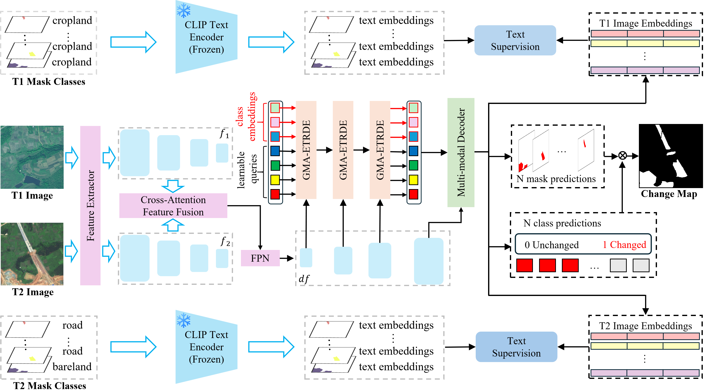

# TextMCD

Official implementation for the paper "TextMCD: Mask Classification Based Change Detection Network Combining Multimodal Vision-Language Supervised Learning"



## Usage

### Install

* Create a conda virtual environment and activate it:

```sh
conda create -n ecd python=3.10 -y
conda activate ecd
pip install -r requirements.txt
```

### Data Preparation

Dataset download link:

* LEVIR-CD [https://justchenhao.github.io/LEVIR/](https://justchenhao.github.io/LEVIR/)
* WHUCD [https://gpcv.whu.edu.cn/data/building_dataset.html](https://gpcv.whu.edu.cn/data/building_dataset.html)
* CLCD [https://github.com/liumency/CropLand-CD](https://github.com/liumency/CropLand-CD)
* SECOND [https://captain-whu.github.io/SCD/](https://captain-whu.github.io/SCD/)

After downloading and processing, move it to ./data folder. This folder path can be modified in corresponding config file.

### Model Preparation

Pretrained model file download link:

CLIP [https://github.com/open-mmlab/mmpretrain/tree/main/configs/clip](https://github.com/open-mmlab/mmpretrain/tree/main/configs/clip)

Move pretrained model file to ./pretraned_models, this folder path can also be modified in corresponding config file.

## Inference

```sh
python application/cd_application.py --config application/predict_pred.yaml
```

## Train

```sh
python Solve.py --config configs/textmcd/cd_mmseg_clcd.yaml --gpus 0
```

## Supported Models

This repository provides implementations and unified evaluation pipelines for several representative **change detection models**. The supported models include:

* BAN 
  [Li, Kaiyu, Xiangyong Cao, and Deyu Meng. "A new learning paradigm for foundation model-based remote-sensing change detection." IEEE Transactions on Geoscience and Remote Sensing 62 (2024): 1-12.](https://ieeexplore.ieee.org/abstract/document/10438490/)
* ChangeCLIP
  [Dong, Sijun, et al. "ChangeCLIP: Remote sensing change detection with multimodal vision-language representation learning." ISPRS Journal of Photogrammetry and Remote Sensing 208 (2024): 53-69.](https://www.sciencedirect.com/science/article/abs/pii/S0924271624000042)
* TextSCD
  [Huang, Haiyan, et al. "TextSCD: Leveraging Text-based Semantic Guidance for Remote Sensing Image Semantic Change Detection." ISPRS Annals of the Photogrammetry, Remote Sensing and Spatial Information Sciences (2025): 383-389.](https://isprs-annals.copernicus.org/articles/X-G-2025/383/2025/isprs-annals-X-G-2025-383-2025.html)
* MDS-Net
  [Wang, Tao, et al. "MDS-Net: An Image-Text Enhanced Multimodal Dual-Branch Siamese Network for Remote Sensing Change Detection." IEEE Journal of Selected Topics in Applied Earth Observations and Remote Sensing (2025).](https://ieeexplore.ieee.org/abstract/document/10989581)
* MGCR
  [Wang, Chengming, et al. "MGCR-Net: Multimodal Graph-Conditioned Vision-Language Reconstruction Network for Remote Sensing Change Detection." arXiv preprint arXiv:2508.01555 (2025).](https://arxiv.org/abs/2508.01555)
* MMChange
  [Zhou, Yijun, et al. "Multimodal Feature Fusion Network With Text Difference Enhancement for Remote Sensing Change Detection." IEEE Transactions on Geoscience and Remote Sensing 63 (2025): 1-17.](https://ieeexplore.ieee.org/abstract/document/11244183)
